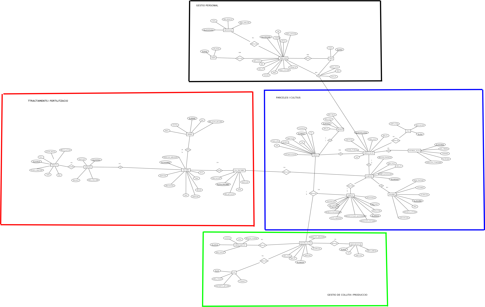

  
  
  # MEMÒRIA TÈCNICA DEL PROJECTE
  # GESTIÓ INTEGRAL D'EXPLOTACIÓ AGRÍCOLA
  
   

  **Autors:** [Usman Kane, Xavier Santaularia, Pol Farre]  
  **Curs:** 2n Desenvolupament d'Aplicacions Web (DAW)  
  **Data:** Desembre 2025

   
   

---

## 📑 Índex Detallat

1.  [Presentació i Context](#1-presentació-i-context)
2.  [Descripció Detallada del Projecte](#2-descripció-detallada-del-projecte)
3.  [Anàlisi Exhaustiva de Requisits](#3-anàlisi-exhaustiva-de-requisits)
4.  [Disseny i Arquitectura del Sistema](#4-disseny-i-arquitectura-del-sistema)
5.  [Model de Dades i Persistència](#5-model-de-dades-i-persistència)
6.  [Desenvolupament i Implementació Tècnica](#6-desenvolupament-i-implementació-tècnica)
7.  [Cas Pràctic: Explotació a Mollerussa](#7-cas-pràctic-explotació-a-mollerussa)
8.  [Seguretat i Protecció de Dades](#8-seguretat-i-protecció-de-dades)
9.  [Manual d'Usuari i Guia d'Ús](#9-manual-dusuari-i-guia-dús)
10. [Conclusions](#10-conclusions)

---

## 1. 🚀 Presentació i Context

### 1.1. L'Equip i la Motivació
Aquest projecte ha estat realitzat per **Xavier Santaularia, Usman Kane i Pol Farre**. Neix com a resposta a una necessitat real detectada en l'estudi d'una explotació fruitera. L'objectiu principal és comprendre a fons com funciona aquest tipus d'explotació agrícola, quins processos s'hi duen a terme i quina importància té dins del sector primari i de l'economia local.

> "Aquest projecte ens permet entendre millor la feina dels agricultors i valorar l'esforç que hi ha darrere dels aliments que consumim diàriament. A més, ens ajuda a relacionar els continguts treballats a classe amb un exemple real i proper."

### 1.2. Justificació Tecnològica
El sector primari s'enfronta a la necessitat d'optimitzar recursos. La gestió tradicional (paper) provoca pèrdua d'informació i dificulta el compliment de normatives de traçabilitat. Aquesta aplicació web pretén digitalitzar tot el flux de treball, des del camp fins al consumidor.

---

## 2. 💡 Descripció Detallada del Projecte

L'aplicació és un **Sistema de Gestió Empresarial (ERP)** verticalitzat per al sector agrari.

### Àmbit d'Aplicació
El sistema gestiona el cicle complet:
1.  **Configuració**: Definició de parcel·les i cultius.
2.  **Operativa**: Registre de tasques i tractaments fitosanitaris.
3.  **Collita**: Control de quilos, lots i qualitat.
4.  **Anàlisi**: Visualització de dades per a la presa de decisions.

---

## 3. 📋 Anàlisi Exhaustiva de Requisits

### 3.1. Requisits Funcionals (RF)
*   **RF1 - Gestió d'Usuaris**: Rols diferenciats (Admin, Gestor, Treballador).
*   **RF2 - Gestió Espacial (GIS)**: Dibuix de parcel·les sobre mapa satèl·lit i càlcul d'àrees.
*   **RF3 - Recursos Humans**: Gestió de contractes i certificacions.
*   **RF4 - Traçabilitat**: Vinculació total entre Parcel·la -> Tractament -> Collita.

### 3.2. Requisits No Funcionals (RNF)
*   **RNF1 - Usabilitat**: Interfície intuïtiva per a usuaris no tècnics.
*   **RNF2 - Rendiment**: Càrrega ràpida en entorns rurals (4G).
*   **RNF3 - Seguretat**: Encriptació SSL i protecció de dades (OWASP).

---

## 4. 🏗️ Disseny i Arquitectura del Sistema

### 4.1. Entorn Tecnològic: XAMPP
Hem seleccionat l'stack **XAMPP** per la seva robustesa i facilitat de desplegament.

  PHP 8.2
  MariaDB 10.4
  Apache 2.4
  JavaScript ES6

 

*   **Apache**: Servidor web.
*   **MariaDB**: Base de dades relacional.
*   **PHP**: Lògica de negoci i API REST.

### 4.2. Arquitectura Client-Servidor
*   **Frontend**: HTML5/CSS3/JS (Vanilla). Ús de `Fetch API` per a comunicació asíncrona.
*   **Backend**: API PHP que processa peticions JSON i gestiona la persistència.

---

## 5. 🗄️ Model de Dades i Persistència

El sistema es basa en una base de dades relacional normalitzada (3NF).

### 5.1. Esquema Relacional (ERD)

  
  
Figura 1: Diagrama complet de la base de dades.

### 5.2. Entitats Principals
*   **`usuaris`**: Credencials i rols.
*   **`parceles`**: Unitats de terra amb geometria JSON.
*   **`plantacions`**: Cultius actius.
*   **`collites`**: Registre de producció.

---

## 6. 💻 Desenvolupament i Implementació Tècnica

### 6.1. Estructura Modular
*   📂 `/css`: Estils globals (`styles.css`).
*   📂 `/js`: Lògica modular (`map.js`, `personal.js`).
*   📂 `/php`: API REST (`save_*.php`, `get_*.php`).

### 6.2. Algoritmes Clau
*   **Privacitat**: Filtre automàtic per `id_propietari` a totes les consultes SQL.
*   **GIS**: Integració de **Leaflet.js** per a la gestió de mapes i geometries GeoJSON.

---

## 7. 📍 Cas Pràctic: Explotació a Mollerussa

Per validar el sistema, hem utilitzat dades reals d'una finca situada a **Negrals, Mollerussa (Lleida)**. Aquestes dades demostren la capacitat del sistema per gestionar informació precisa.

### Fitxa Tècnica de la Parcel·la de Prova

  <h3>🏡 Dades de la Parcel·la</h3>
  

    🆔 Referència Cadastral:
    25172A005000200000SJ
  

  

    📍 Localització:
    Polígon 5, Parcel·la 20
  

  

    🌍 Ubicació (DMS):
    41°37'32"N 0°52'53"E
  

  

    🛰️ Coordenades (Decimal):
    41.625973, 0.881318
  

  

    📏 Perímetre:
    793,81 m
  

  

    🟩 Superfície Gràfica:
    39.609 m² (3.96 Ha)
  

Aquesta informació s'ha introduït al sistema mitjançant l'eina de dibuix sobre mapa, verificant que el càlcul d'àrea automàtic de l'aplicació coincideix amb les dades oficials del cadastre.

---

## 8. 🔒 Seguretat i Protecció de Dades

1.  **Encriptació**: Contrasenyes protegides amb **Bcrypt**.
2.  **Anti-SQL Injection**: Ús exclusiu de **PDO Prepared Statements**.
3.  **Sessions**: Cookies `HttpOnly` per prevenir XSS.

---

## 9. 📸 Manual d'Usuari i Guia d'Ús

### 9.1. Dashboard
Visió general de l'explotació.

  
  
Figura 2: Pàgina d'inici amb el nou disseny corporatiu.

### 9.2. Gestió de Parcel·les
Visualització i edició sobre mapa satèl·lit.

  
  
Figura 3: Visualització de parcel·les sobre mapa satèl·lit.

### 9.3. Personal
Gestió de treballadors i usuaris.

  
  
Figura 4: Llistat de treballadors i gestió d'usuaris.

### 9.4. Instal·lació
Configuració automàtica de la base de dades.

  
  
Figura 5: Assistent de configuració automàtica.

---

## 10. 🏁 Conclusions

El projecte ha complert els seus objectius, proporcionant una eina útil per a la gestió agrícola moderna. Hem après a integrar tecnologies web amb necessitats reals del sector primari, creant un producte que no només és funcional, sinó també segur i escalable.

Esperem que aquesta documentació serveixi per explicar de manera clara i entenedora el funcionament d'una explotació fruitera i la seva importància dins la nostra societat.

---

  <i>Document tècnic generat per a l'assignatura de Projecte Web - Desembre 2025</i>

